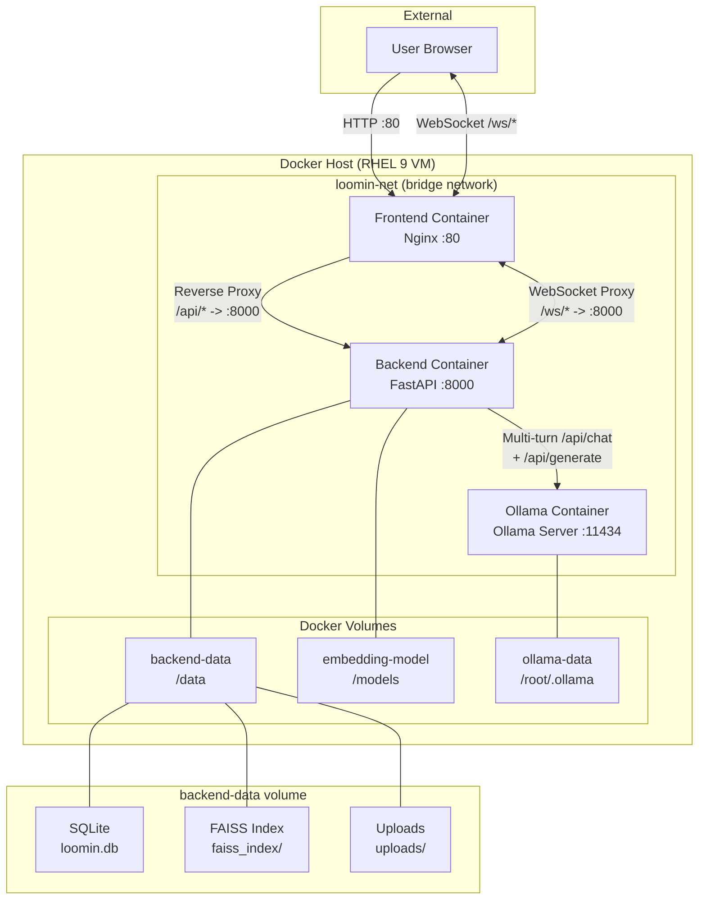
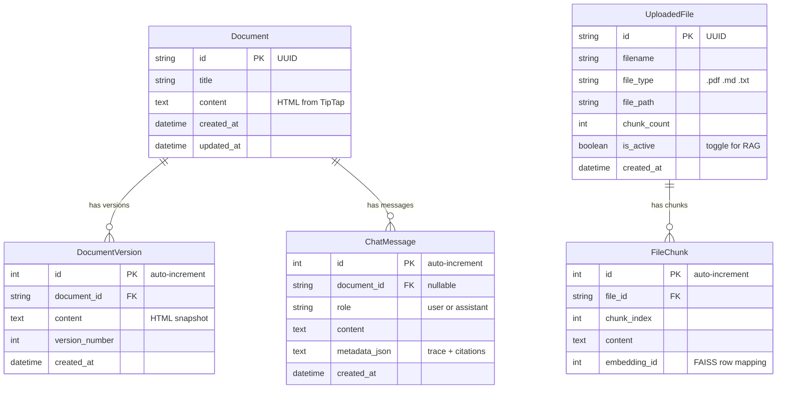
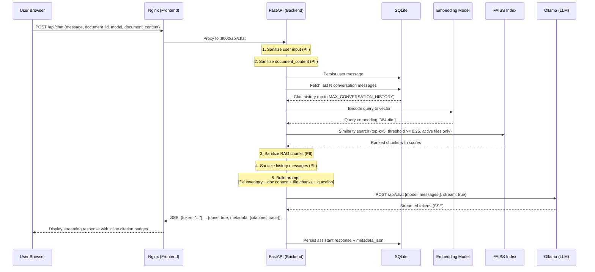
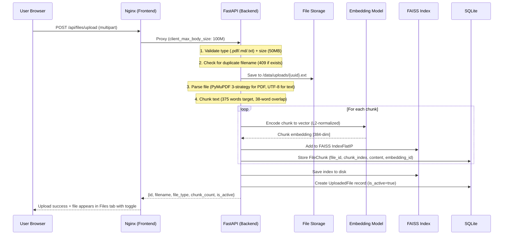
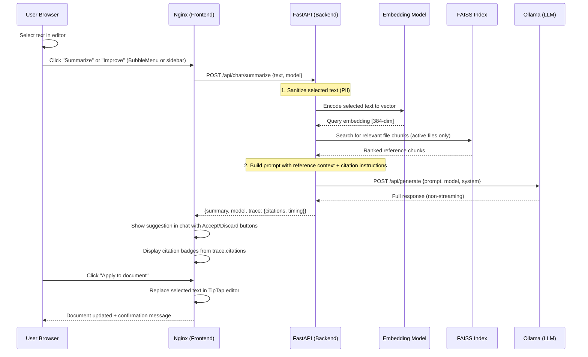
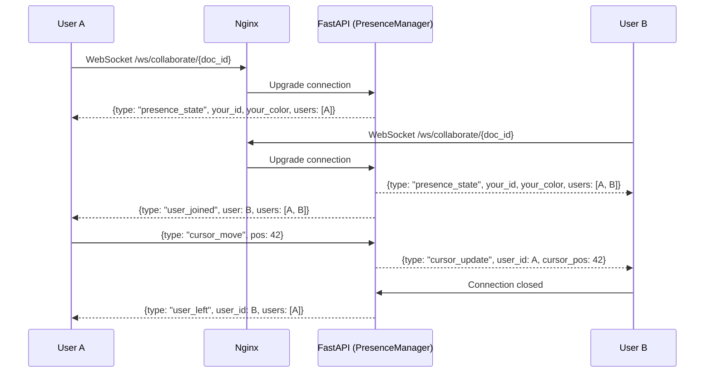
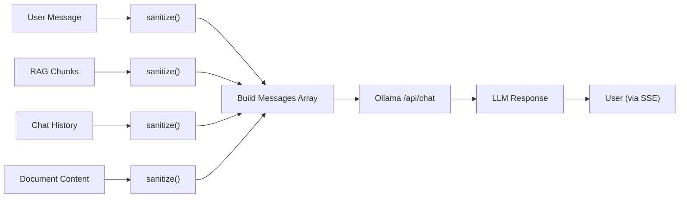

# Loomin-Docs Architecture

This document describes the system architecture, data flows, component responsibilities, security considerations, and performance characteristics of Loomin-Docs.

## System Overview

Loomin-Docs is a three-container application orchestrated by Docker Compose. All containers communicate over an internal bridge network (`loomin-net`). The only externally exposed port in production is port 80 (Nginx), which serves the frontend, proxies API requests to the backend, and upgrades WebSocket connections for real-time collaboration.



## Component Details

### Frontend (Nginx + React)

- **Image**: `loomin-frontend:latest` (multi-stage: Node 20 builder -> Nginx Alpine)
- **Responsibilities**:
  - Serve the compiled React SPA (TipTap editor, AI sidebar, file manager)
  - Reverse-proxy all `/api/*` requests to the backend on port 8000
  - WebSocket proxy for `/ws/*` with 24h timeout for real-time collaboration
  - Handle file uploads up to 100 MB (`client_max_body_size 100M`)
  - Proxy timeouts: 600s read/send for long LLM inference
- **Port**: 80 (exposed to host)
- **Key Frontend Components**:
  - `Editor/Editor.tsx` -- TipTap rich text editor with BubbleMenu (Summarize/Improve), `replaceSelection` and `setContent` imperative handles
  - `Editor/Toolbar.tsx` -- Formatting toolbar: H1-H3, bold, italic, underline, strikethrough, code, lists, blockquotes
  - `Sidebar/Sidebar.tsx` -- Three-tab container (Chat, Files, History) with all panels mounted for state preservation
  - `Sidebar/ChatPanel.tsx` -- Multi-turn AI chat with SSE streaming, typing indicator, citation badges, action trace badges, Accept/Discard flow
  - `Sidebar/FilesPanel.tsx` -- File upload (drag-and-drop), toggle on/off, chunk previews, delete with highlighting
  - `Sidebar/VersionPanel.tsx` -- Version history browser with preview, restore, time-ago display
  - `Sidebar/ModelSelector.tsx` -- Dropdown toggling between Ollama models with size display
  - `TokenVisualization/TokenBar.tsx` -- Segmented context window bar (blue=doc, amber=files, gray=free)
  - `Layout.tsx` -- Header bar with editable title, save status, presence avatars, word count, export dropdown, keyboard shortcuts
- **Hooks**:
  - `useApi.ts` -- `useDocuments`, `useChat`, `useFiles`, `useModels`, `useTokenCount` with debounced API calls
  - `usePresence.ts` -- WebSocket hook for real-time user presence per document

### Backend (FastAPI)

- **Image**: `loomin-backend:latest` (Python 3.11 slim)
- **Responsibilities**:
  - RESTful API for chat, documents, files, models, and token counting
  - WebSocket endpoint for real-time collaboration presence (`/ws/collaborate/{document_id}`)
  - Multi-turn conversation: fetches recent history from SQLite, assembles messages array
  - Dual-context RAG pipeline: query embedding -> FAISS search (threshold >= 0.25) -> context injection from BOTH active editor content AND uploaded file chunks
  - RAG-grounded Summarize/Improve: retrieves relevant file chunks for contextual rewrites with inline citations
  - PII sanitization on user input, RAG chunks, document content, AND conversation history (4 interception points)
  - Latency tracing on every AI response (`request_id`, `retrieval_time_ms`, `generation_time_ms`, `tokens_per_second`)
  - Document versioning: auto-creates new version on every update, browsable via API
  - File management: parse -> chunk -> embed -> FAISS index -> SQLite, with toggle on/off for RAG inclusion
  - Lightweight SQLite migrations for backward-compatible schema changes
- **Port**: 8000
- **Volumes**:
  - `backend-data:/data` -- SQLite database, FAISS index, uploaded files
  - `embedding-model:/models` -- Sentence-transformer model files
- **Health Check**: `python -c "import urllib.request; urllib.request.urlopen('http://localhost:8000/health')"`
- **Configuration** (all env-configurable):
  - `DATABASE_URL` -- SQLite connection string
  - `OLLAMA_BASE_URL` -- Ollama container URL
  - `EMBEDDING_MODEL_PATH` -- Path to embedding model (explicit error if missing in air-gapped mode)
  - `DEFAULT_MODEL` -- Default Ollama model (`llama3.2:1b`)
  - `MAX_CHUNKS_RETRIEVED` -- Top-K chunks for RAG (default: 5)
  - `MIN_SIMILARITY_SCORE` -- Minimum FAISS score threshold (default: 0.25)
  - `MAX_CONVERSATION_HISTORY` -- Messages in multi-turn context (default: 100)

### Ollama (LLM Server)

- **Image**: `ollama/ollama:latest`
- **Responsibilities**:
  - Serve multiple language models (llama3.2:1b, gemma3:1b, llama3.2:1b)
  - Provide `/api/chat` (multi-turn) and `/api/generate` (single-shot) inference APIs
  - Auto-pull models on first boot via `ollama-entrypoint.sh`
  - Create custom `loomin` model from mounted Modelfile (`ollama create loomin -f /Modelfile`)
  - Graceful fallback in air-gapped mode (pre-loaded models from volume)
- **Port**: 11434
- **Volumes**:
  - `ollama-data:/root/.ollama` -- Model weights, manifests
  - `Modelfile:/Modelfile` -- Custom model definition (mounted read-only)
- **Health Check**: `test -f /tmp/.ollama-models-ready` (marker created after all models loaded + custom model created)
- **Entrypoint**: Custom `ollama-entrypoint.sh` starts server, pulls/verifies models, runs `ollama create`, creates readiness marker

## Database Schema (5 Tables)



### Schema Migrations

The application uses lightweight SQLite-specific migrations (no Alembic dependency). On startup, `init_db()` creates tables via `metadata.create_all`, then runs `_run_migrations()` which uses `PRAGMA table_info` to detect missing columns and adds them via `ALTER TABLE`. This ensures backward compatibility when upgrading an existing database (e.g., adding the `is_active` column to `uploaded_files`).

## Dual Deployment Strategy

| Aspect | Development (Internet) | Air-Gapped (RHEL 9) |
|--------|----------------------|---------------------|
| Compose file | `docker-compose.yml` (with `build:` directives) | `docker-compose.prod.yml` (image-only, no build) |
| Images | Built from source via `docker compose up --build` | Pre-loaded from `.tar` via `docker load -i` |
| Ollama models | Pulled from registry on first boot | Pre-loaded in `ollama-data` volume by `setup.sh` |
| Custom model | Created via `ollama create loomin -f /Modelfile` | Same -- Modelfile mounted from package |
| Embedding model | Auto-downloaded from HuggingFace if missing | Pre-loaded in `embedding-model` volume by `setup.sh` |
| Docker RPMs | Already installed | Installed from bundled RPMs by `setup.sh` |

## Data Flow Diagrams

### Multi-Turn Chat with RAG (Dual Context)



### Document Upload and Indexing



### Contextual Editing (Summarize / Improve) with RAG Grounding



### Real-Time Collaboration Presence



## Security Considerations

### PII Sanitization Flow

PII sanitization is applied at **four points** in the pipeline:



**Detected PII patterns (6 types):**

| Pattern           | Example                     | Replacement           |
|-------------------|-----------------------------|-----------------------|
| SSN               | `123-45-6789`               | `[SSN-REDACTED]`      |
| Credit Card       | `4111-1111-1111-1111`       | `[CC-REDACTED]`       |
| AWS Key           | `AKIA1234567890ABCDEF`      | `[AWS-KEY-REDACTED]`  |
| API Key           | `sk-abc123...`              | `[API-KEY-REDACTED]`  |
| Email             | `user@example.com`          | `[EMAIL-REDACTED]`    |
| Phone             | `(503) 555-0142`            | `[PHONE-REDACTED]`    |

### RAG Faithfulness Enforcement (3 layers)

```
Layer 1: RETRIEVAL FILTERING
  FAISS search -> only chunks with score >= 0.25 pass
  Only chunks from is_active=true files are returned

Layer 2: PROMPT ENGINEERING
  With context:    "Answer using ONLY the context above (current document and/or uploaded files)"
  Without context: "No files uploaded / no relevant content found -- do NOT answer from training"
  Summarize/Improve: "Use reference context to ensure factual accuracy. Cite [Source N]"

Layer 3: SYSTEM PROMPT (7 rules, always active)
  Rule 1: ONLY use provided context (document content + uploaded files)
  Rule 2: NEVER use training knowledge for factual questions
  Rule 3: Cite [Source N] when referencing uploaded files
  Rule 4: Use CURRENT DOCUMENT section for document questions
  Rule 5: Say "I don't have information" if not in context
  Rule 6: Tell user to upload files or write content if no context
  Rule 7: Be concise, helpful, and professional
```

### Network Isolation

- Docker bridge network (`loomin-net`) is internal only
- In air-gapped environment, the host has no outbound internet
- Ports 8000 and 11434 can be restricted to `127.0.0.1` in production
- WebSocket connections proxied through Nginx (no direct backend exposure)

## Token Estimation

Token counts are estimated using a hybrid heuristic for robustness across text types:

```
estimate = max(char_count / 4, word_count * 1.3)
```

- **Character-based** (`char_count / 4`): Standard for English prose with GPT/Llama tokenizers (~4 chars per token)
- **Word-based** (`word_count * 1.3`): Cross-check for shorter texts where character count underestimates
- The segmented token bar breaks down: **document tokens** (from editor content) + **file chunk tokens** (from active uploaded files) + **free tokens** (remaining context window)

Context window sizes are resolved from a built-in model lookup table with prefix matching (e.g., `llama3.2:1b` -> 131072 tokens).

## Performance Characteristics

| Operation                  | Expected Latency       | Bottleneck                    |
|----------------------------|------------------------|-------------------------------|
| Document upload (1 MB)     | 2-5 seconds            | Text extraction + embedding   |
| FAISS similarity search    | < 50 ms                | In-memory vector search       |
| Embedding a query          | 20-100 ms              | CPU-bound model inference     |
| LLM response (first token) | 1-5 seconds           | Model loading / prompt eval   |
| LLM response (streaming)  | 10-60 seconds total    | Token generation speed        |
| WebSocket presence event   | < 10 ms                | In-memory broadcast           |
| Version history fetch      | < 50 ms                | SQLite query                  |

### Resource Requirements

| Resource | Minimum     | Recommended  | Notes                                |
|----------|-------------|--------------|--------------------------------------|
| CPU      | 4 cores     | 8+ cores     | LLM inference is CPU-intensive       |
| RAM      | 8 GB        | 16+ GB       | Multiple models loaded concurrently  |
| Disk     | 20 GB       | 50+ GB       | Model weights + document storage     |
| GPU      | Not required | NVIDIA GPU  | Dramatically improves LLM speed      |

## Volume Layout

```
backend-data (/data)
├── loomin.db                    # SQLite (documents, versions, chat, files, chunks)
├── faiss_index/
│   └── index.faiss              # Serialized FAISS IndexFlatIP
└── uploads/
    ├── {uuid}.pdf
    ├── {uuid}.md
    └── {uuid}.txt

embedding-model (/models)
└── all-MiniLM-L6-v2/           # Sentence-transformers model
    ├── config.json
    ├── tokenizer.json
    ├── model.safetensors
    └── ...

ollama-data (/root/.ollama)
└── models/
    ├── blobs/                   # Model weight files (SHA256)
    └── manifests/               # Model metadata
        └── registry.ollama.ai/
            └── library/
                ├── llama3.2/
                ├── gemma3/
                └── gemma3/
```

## Modelfile

The custom `loomin` model is created automatically at container startup via `ollama create loomin -f /Modelfile`. The Modelfile is mounted from `backend/Modelfile` into the Ollama container.

```
FROM llama3.2:1b
SYSTEM """7-rule RAG faithfulness prompt..."""
PARAMETER temperature 0.7
PARAMETER top_p 0.9
```

The same system prompt is also injected at the API level in `chat.py` for all models (not just `loomin`), ensuring consistent behavior regardless of which model the user selects.

## Nginx Proxy Configuration

```
/           -> Static React SPA (try_files with SPA fallback)
/api/*      -> Backend :8000 (HTTP 1.1, buffering off, 600s timeout)
/ws/*       -> Backend :8000 (WebSocket upgrade, 86400s timeout)
```

- `client_max_body_size 100M` for file uploads
- WebSocket proxy uses `Connection: "upgrade"` header with 24-hour idle timeout
- API proxy disables buffering and caching for SSE streaming compatibility
