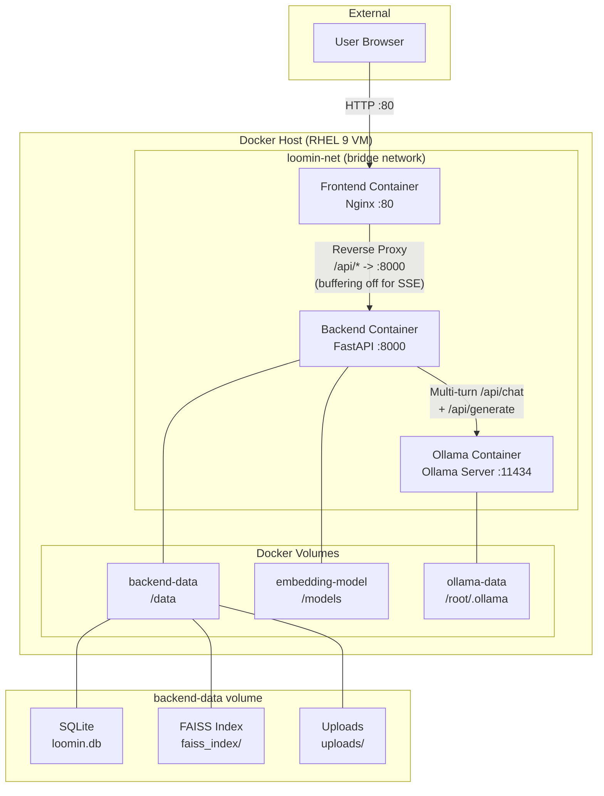
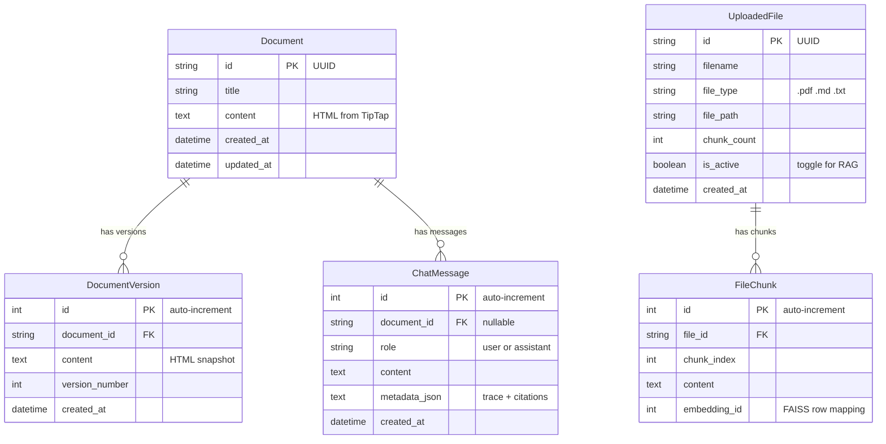
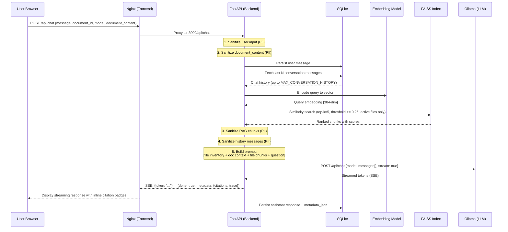
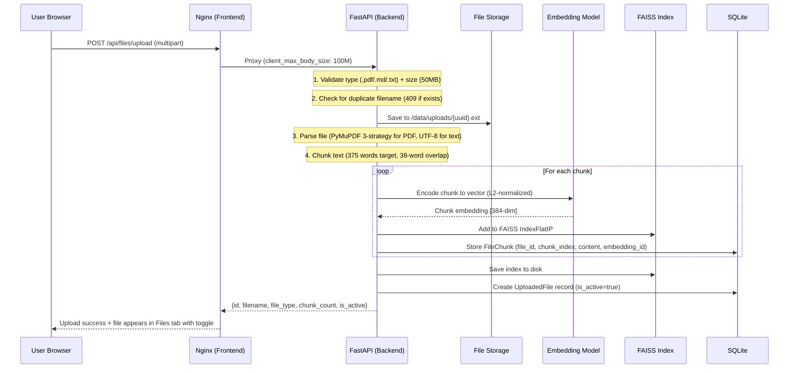
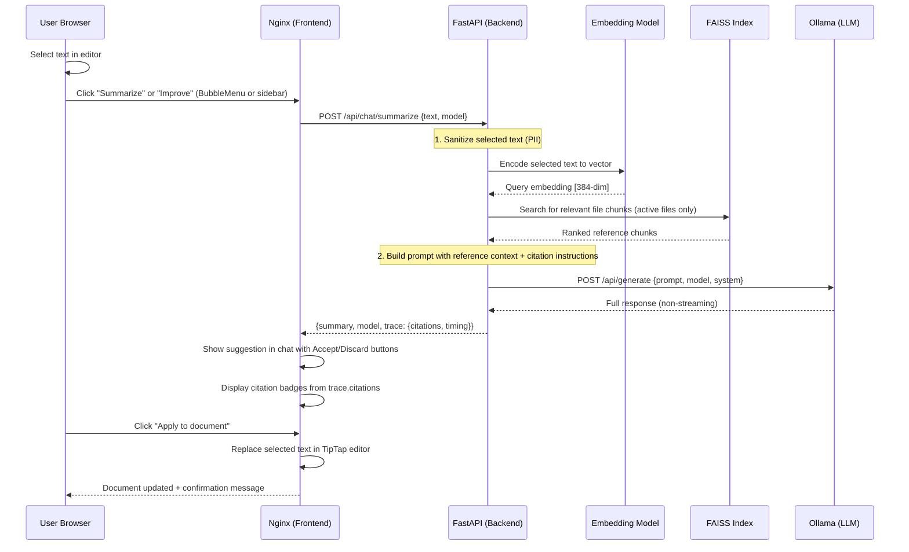
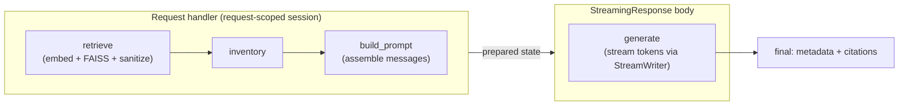
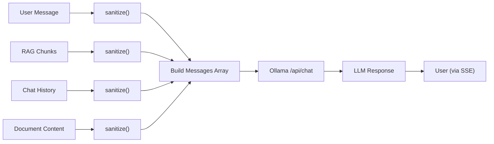

# Loomin-Docs Architecture

This document describes the system architecture, data flows, component responsibilities, security considerations, and performance characteristics of Loomin-Docs.

## System Overview

Loomin-Docs is a three-container application orchestrated by Docker Compose. All containers communicate over an internal bridge network (`loomin-net`). Port 80 (Nginx) serves the frontend and reverse-proxies API requests to the backend; it is the only port that needs to be reachable in production.

> Both Compose files also publish ports 8000 and 11434 on the host for debugging. See [SECURITY.md](SECURITY.md) for how to close them in a hardened deployment.


```mermaid
graph TB
    subgraph "External"
        User["User Browser"]
    end

    subgraph "Docker Host (RHEL 9 VM)"
        subgraph "loomin-net (bridge network)"
            FE["Frontend Container<br/>Nginx :80"]
            BE["Backend Container<br/>FastAPI :8000"]
            OL["Ollama Container<br/>Ollama Server :11434"]
        end

        subgraph "Docker Volumes"
            V1["backend-data<br/>/data"]
            V2["embedding-model<br/>/models"]
            V3["ollama-data<br/>/root/.ollama"]
        end
    end

    User -->|"HTTP :80"| FE
    FE -->|"Reverse Proxy<br/>/api/* -> :8000<br/>(buffering off for SSE)"| BE
    BE -->|"Multi-turn /api/chat<br/>+ /api/generate"| OL

    BE --- V1
    BE --- V2
    OL --- V3

    subgraph "backend-data volume"
        DB["SQLite<br/>loomin.db"]
        FI["FAISS Index<br/>faiss_index/"]
        UL["Uploads<br/>uploads/"]
    end

    V1 --- DB
    V1 --- FI
    V1 --- UL
```

## Component Details

### Frontend (Nginx + React)

- **Image**: `loomin-frontend:latest` (multi-stage: Node 20 builder -> Nginx Alpine)
- **Responsibilities**:
  - Serve the compiled React SPA (TipTap editor, AI sidebar, file manager)
  - Reverse-proxy all `/api/*` requests to the backend on port 8000
  - Handle file uploads up to 100 MB (`client_max_body_size 100M`)
  - Proxy timeouts: 600s read/send for long LLM inference
- **Port**: 80 (exposed to host)
- **Key Frontend Components**:
  - `Editor/Editor.tsx` -- TipTap rich text editor with BubbleMenu (Summarize/Improve), `replaceSelection` and `setContent` imperative handles
  - `Editor/Toolbar.tsx` -- Formatting toolbar: H1-H3, bold, italic, underline, strikethrough, code, lists, blockquotes
  - `Sidebar/Sidebar.tsx` -- Three-tab container (Chat, Files, History) with all panels mounted for state preservation
  - `Sidebar/ChatPanel.tsx` -- Multi-turn AI chat with SSE streaming, typing indicator, citation badges, action trace badges, Accept/Discard flow
  - `Sidebar/FilesPanel.tsx` -- File upload (drag-and-drop), toggle on/off, chunk previews, delete with highlighting
  - `Sidebar/VersionPanel.tsx` -- Version history browser with preview, restore, time-ago display
  - `Sidebar/ModelSelector.tsx` -- Dropdown toggling between Ollama models with size display
  - `TokenVisualization/TokenBar.tsx` -- Segmented context window bar (blue=doc, amber=files, gray=free)
  - `Layout.tsx` -- Header bar with editable title, save status, word count, export dropdown, keyboard shortcuts, resizable sidebar divider
- **Hooks**:
  - `useApi.ts` -- `useDocuments`, `useChat`, `useFiles`, `useModels`, `useTokenCount` with debounced API calls

### Backend (FastAPI)

- **Image**: `loomin-backend:latest` (Python 3.11 slim)
- **Responsibilities**:
  - RESTful API for chat, documents, files, models, and token counting
  - Multi-turn conversation: fetches recent history from SQLite, assembles messages array
  - Dual-context RAG pipeline: query embedding -> FAISS search (threshold >= 0.25) -> context injection from BOTH active editor content AND uploaded file chunks
  - RAG-grounded Summarize/Improve: retrieves relevant file chunks for contextual rewrites with inline citations
  - PII sanitization on user input, RAG chunks, document content, AND conversation history (4 interception points)
  - Latency tracing on every AI response (`request_id`, `retrieval_time_ms`, `generation_time_ms`, `tokens_per_second`)
  - Document versioning: auto-creates new version on every update, browsable via API
  - File management: parse -> chunk -> embed -> FAISS index -> SQLite, with toggle on/off for RAG inclusion
  - Lightweight SQLite migrations for backward-compatible schema changes
- **Port**: 8000
- **Volumes**:
  - `backend-data:/data` -- SQLite database, FAISS index, uploaded files
  - `embedding-model:/models` -- Sentence-transformer model files
- **Health Check**: `python -c "import urllib.request; urllib.request.urlopen('http://localhost:8000/health')"`
- **Configuration** (all env-configurable):
  - `DATABASE_URL` -- SQLite connection string
  - `OLLAMA_BASE_URL` -- Ollama container URL
  - `EMBEDDING_MODEL_PATH` -- Path to embedding model (explicit error if missing in air-gapped mode)
  - `DEFAULT_MODEL` -- Default Ollama model (`llama3.2:1b`)
  - `MAX_CHUNKS_RETRIEVED` -- Top-K chunks for RAG (default: 5)
  - `MIN_SIMILARITY_SCORE` -- Minimum FAISS score threshold (default: 0.25)
  - `MAX_CONVERSATION_HISTORY` -- Messages in multi-turn context (default: 100)

### Ollama (LLM Server)

- **Image**: `ollama/ollama:latest`
- **Responsibilities**:
  - Serve the language models listed in `OLLAMA_MODELS` (`llama3.2:1b` and `gemma3:1b` by default)
  - Provide `/api/chat` (multi-turn) and `/api/generate` (single-shot) inference APIs
  - Auto-pull models on first boot via `ollama-entrypoint.sh`
  - Graceful fallback in air-gapped mode (pre-loaded models from volume; pull failures are expected and non-fatal)
- **Port**: 11434
- **Volumes**:
  - `ollama-data:/root/.ollama` -- Model weights, manifests
  - `ollama-entrypoint.sh:/ollama-entrypoint.sh` -- Startup script (mounted read-only)
- **Health Check**: `test -f /tmp/.ollama-models-ready` (marker written once model loading finishes)
- **Entrypoint**: Custom `ollama-entrypoint.sh` starts the server, pulls or verifies each model with a 10s timeout, then creates the readiness marker the backend's `depends_on` waits for

## Database Schema (5 Tables)


```mermaid
erDiagram
    Document ||--o{ DocumentVersion : "has versions"
    Document ||--o{ ChatMessage : "has messages"
    UploadedFile ||--o{ FileChunk : "has chunks"

    Document {
        string id PK "UUID"
        string title
        text content "HTML from TipTap"
        datetime created_at
        datetime updated_at
    }

    DocumentVersion {
        int id PK "auto-increment"
        string document_id FK
        text content "HTML snapshot"
        int version_number
        datetime created_at
    }

    ChatMessage {
        int id PK "auto-increment"
        string document_id FK "nullable"
        string role "user or assistant"
        text content
        text metadata_json "trace + citations"
        datetime created_at
    }

    UploadedFile {
        string id PK "UUID"
        string filename
        string file_type ".pdf .md .txt"
        string file_path
        int chunk_count
        boolean is_active "toggle for RAG"
        datetime created_at
    }

    FileChunk {
        int id PK "auto-increment"
        string file_id FK
        int chunk_index
        text content
        int embedding_id "FAISS row mapping"
    }
```

### Schema Migrations

The application uses lightweight SQLite-specific migrations (no Alembic dependency). On startup, `init_db()` creates tables via `metadata.create_all`, then runs `_run_migrations()` which uses `PRAGMA table_info` to detect missing columns and adds them via `ALTER TABLE`. This ensures backward compatibility when upgrading an existing database (e.g., adding the `is_active` column to `uploaded_files`).

## Dual Deployment Strategy

| Aspect | Development (Internet) | Air-Gapped (RHEL 9) |
|--------|----------------------|---------------------|
| Compose file | `docker-compose.yml` (with `build:` directives) | `docker-compose.prod.yml` (image-only, no build) |
| Images | Built from source via `docker compose up --build` | Pre-loaded from `.tar` via `docker load -i` |
| Ollama models | Pulled from registry on first boot | Pre-loaded in `ollama-data` volume by `setup.sh` |
| System prompt | Applied at the API level in `chat.py` | Same -- no model-side customization needed |
| Embedding model | Auto-downloaded from HuggingFace if missing | Pre-loaded in `embedding-model` volume by `setup.sh` |
| Volumes | Created by Compose | Declared `external` -- populated by `setup.sh` first |
| Docker RPMs | Already installed | Installed from bundled RPMs by `setup.sh` |

## Data Flow Diagrams

### Multi-Turn Chat with RAG (Dual Context)


```mermaid
sequenceDiagram
    participant U as User Browser
    participant FE as Nginx (Frontend)
    participant BE as FastAPI (Backend)
    participant DB as SQLite
    participant EMB as Embedding Model
    participant FX as FAISS Index
    participant OL as Ollama (LLM)

    U->>FE: POST /api/chat {message, document_id, model, document_content}
    FE->>BE: Proxy to :8000/api/chat

    Note over BE: 1. Sanitize user input (PII)
    Note over BE: 2. Sanitize document_content (PII)
    BE->>DB: Persist user message
    BE->>DB: Fetch last N conversation messages
    DB-->>BE: Chat history (up to MAX_CONVERSATION_HISTORY)

    BE->>EMB: Encode query to vector
    EMB-->>BE: Query embedding [384-dim]

    BE->>FX: Similarity search (top-k=5, threshold >= 0.25, active files only)
    FX-->>BE: Ranked chunks with scores

    Note over BE: 3. Sanitize RAG chunks (PII)
    Note over BE: 4. Sanitize history messages (PII)
    Note over BE: 5. Build prompt:<br/>[file inventory + doc context + file chunks + question]

    BE->>OL: POST /api/chat {model, messages[], stream: true}
    OL-->>BE: Streamed tokens (SSE)

    BE-->>FE: SSE: {token: "..."} ... {done: true, metadata: {citations, trace}}
    FE-->>U: Display streaming response with inline citation badges

    BE->>DB: Persist assistant response + metadata_json
```

### Document Upload and Indexing


```mermaid
sequenceDiagram
    participant U as User Browser
    participant FE as Nginx (Frontend)
    participant BE as FastAPI (Backend)
    participant FS as File Storage
    participant EMB as Embedding Model
    participant FX as FAISS Index
    participant DB as SQLite

    U->>FE: POST /api/files/upload (multipart)
    FE->>BE: Proxy (client_max_body_size: 100M)

    Note over BE: 1. Validate type (.pdf/.md/.txt) + size (50MB)
    Note over BE: 2. Check for duplicate filename (409 if exists)

    BE->>FS: Save to /data/uploads/{uuid}.ext
    Note over BE: 3. Parse file (PyMuPDF 3-strategy for PDF, UTF-8 for text)
    Note over BE: 4. Chunk text (375 words target, 38-word overlap)

    loop For each chunk
        BE->>EMB: Encode chunk to vector (L2-normalized)
        EMB-->>BE: Chunk embedding [384-dim]
        BE->>FX: Add to FAISS IndexFlatIP
        BE->>DB: Store FileChunk (file_id, chunk_index, content, embedding_id)
    end

    BE->>FX: Save index to disk
    BE->>DB: Create UploadedFile record (is_active=true)
    BE-->>FE: {id, filename, file_type, chunk_count, is_active}
    FE-->>U: Upload success + file appears in Files tab with toggle
```

### Contextual Editing (Summarize / Improve) with RAG Grounding


```mermaid
sequenceDiagram
    participant U as User Browser
    participant FE as Nginx (Frontend)
    participant BE as FastAPI (Backend)
    participant EMB as Embedding Model
    participant FX as FAISS Index
    participant OL as Ollama (LLM)

    U->>U: Select text in editor
    U->>FE: Click "Summarize" or "Improve" (BubbleMenu or sidebar)

    FE->>BE: POST /api/chat/summarize {text, model}
    Note over BE: 1. Sanitize selected text (PII)

    BE->>EMB: Encode selected text to vector
    EMB-->>BE: Query embedding [384-dim]
    BE->>FX: Search for relevant file chunks (active files only)
    FX-->>BE: Ranked reference chunks

    Note over BE: 2. Build prompt with reference context + citation instructions
    BE->>OL: POST /api/generate {prompt, model, system}
    OL-->>BE: Full response (non-streaming)

    BE-->>FE: {summary, model, trace: {citations, timing}}
    FE->>FE: Show suggestion in chat with Accept/Discard buttons
    FE->>FE: Display citation badges from trace.citations
    U->>FE: Click "Apply to document"
    FE->>FE: Replace selected text in TipTap editor
    FE-->>U: Document updated + confirmation message
```

## Not Yet Implemented

The application is **single-user**. There is no real-time collaboration layer: no WebSocket endpoints, no presence tracking, and no CRDT or operational-transform merge. Two browsers editing the same document will overwrite each other on save, with the losing revision recoverable from version history.

Adding multi-user co-editing would require a WebSocket route on the backend, a `/ws/*` proxy block in `nginx.conf` (currently absent), and a CRDT binding such as Yjs on the TipTap side. This is tracked under [Roadmap](README.md#roadmap).

There is also no authentication layer and no automated test suite — see [SECURITY.md](SECURITY.md) and [CONTRIBUTING.md](CONTRIBUTING.md) respectively.

## LangGraph RAG Pipeline (Optional)

`/api/chat` has two interchangeable implementations selected by the
`USE_LANGGRAPH` setting. With the flag **off** (default), the request handler
runs the inline pipeline described above and `langgraph` is never imported. With
the flag **on**, the same steps run as an explicit LangGraph, split into two
compiled graphs so that error semantics match the legacy path exactly.


```mermaid
graph LR
    subgraph Handler["Request handler (request-scoped session)"]
        direction LR
        P1["retrieve<br/>(embed + FAISS + sanitize)"] --> P2["inventory"] --> P3["build_prompt<br/>(assemble messages)"]
    end
    subgraph Stream["StreamingResponse body"]
        G1["generate<br/>(stream tokens via StreamWriter)"]
    end
    Handler -->|"prepared state"| Stream
    G1 --> FIN["final: metadata + citations"]
```

**Why two graphs.** The *prep graph* (`retrieve → inventory → build_prompt`) runs
eagerly via `prep_graph.ainvoke(...)` **before** the `StreamingResponse` is
returned, using the still-open request session. A failure there (e.g. a missing
FAISS index) propagates as **HTTP 500 with nothing persisted** — identical to the
legacy pipeline, which performs retrieval in the handler body. The *generation
graph* is a single `generate` node streamed with
`astream(stream_mode=["custom", "values"])`: the `custom` channel carries
per-token dicts emitted through an injected `StreamWriter`, and the last
`values` snapshot carries the final citations and trace metadata.

**Design choices**

- **No LangChain model wrapper.** The `generate` node calls the project's own
  `ollama_service` directly, so no `langchain-ollama` dependency is introduced
  and the existing connection/timeout handling is reused.
- **Request-scoped objects in state.** The live SQLAlchemy session and the
  `RequestTrace` pass through graph state. This is safe because the graphs are
  compiled without a checkpointer — state is an in-memory dict that is never
  serialized. Each request supplies its own `initial_state`, so concurrent
  requests are isolated.
- **Parity.** Prompt construction lives in `app/rag/prompting.py`, imported by
  both pipelines, so the two cannot drift. The PII sanitization points, SSE frame
  format, citation/metadata shape, `[:-1]` history exclusion, and assistant
  persistence are all reproduced.

**Extension point.** Retrieval-quality nodes (query rewriting, cross-encoder
reranking, LLM document grading, self-correction loops) slot in between
`retrieve` and `build_prompt` in the prep graph. A cross-encoder reranker would
add a second model to the `embedding-model` volume and to `sideload.sh`.

**Dependencies.** `langgraph` and `langchain-core` are pinned in
`requirements.txt` and baked into the backend image at build time. `sideload.sh`
needs no change — but the backend image must be rebuilt so the offline bundle
captures the new wheels.

## Security Considerations

### PII Sanitization Flow

PII sanitization is applied at **four points** in the pipeline:


```mermaid
flowchart LR
    A["User Message"] --> B["sanitize()"]
    C["RAG Chunks"] --> D["sanitize()"]
    E["Chat History"] --> F["sanitize()"]
    G["Document Content"] --> H["sanitize()"]
    B --> I["Build Messages Array"]
    D --> I
    F --> I
    H --> I
    I --> J["Ollama /api/chat"]
    J --> K["LLM Response"]
    K --> L["User (via SSE)"]
```

**Detected PII patterns (6 types):**

| Pattern           | Example                     | Replacement           |
|-------------------|-----------------------------|-----------------------|
| SSN               | `123-45-6789`               | `[SSN-REDACTED]`      |
| Credit Card       | `4111-1111-1111-1111`       | `[CC-REDACTED]`       |
| AWS Key           | `AKIA1234567890ABCDEF`      | `[AWS-KEY-REDACTED]`  |
| API Key           | `sk-abc123...`              | `[API-KEY-REDACTED]`  |
| Email             | `user@example.com`          | `[EMAIL-REDACTED]`    |
| Phone             | `(503) 555-0142`            | `[PHONE-REDACTED]`    |

### RAG Faithfulness Enforcement (3 layers)

```
Layer 1: RETRIEVAL FILTERING
  FAISS search -> only chunks with score >= 0.25 pass
  Only chunks from is_active=true files are returned

Layer 2: PROMPT ENGINEERING
  With context:    "Answer using ONLY the context above (current document and/or uploaded files)"
  Without context: "No files uploaded / no relevant content found -- do NOT answer from training"
  Summarize/Improve: "Use reference context to ensure factual accuracy. Cite [Source N]"

Layer 3: SYSTEM PROMPT (7 rules, always active)
  Rule 1: ONLY use provided context (document content + uploaded files)
  Rule 2: NEVER use training knowledge for factual questions
  Rule 3: Cite [Source N] when referencing uploaded files
  Rule 4: Use CURRENT DOCUMENT section for document questions
  Rule 5: Say "I don't have information" if not in context
  Rule 6: Tell user to upload files or write content if no context
  Rule 7: Be concise, helpful, and professional
```

### Network Isolation

- Docker bridge network (`loomin-net`) carries all inter-container traffic
- In an air-gapped environment, the host has no outbound internet
- Ports 8000 and 11434 are published to the host by default for debugging and **should** be bound to `127.0.0.1` or unmapped in production
- The application has no authentication of its own; see [SECURITY.md](SECURITY.md) for the full threat model and hardening checklist

## Token Estimation

Token counts are estimated using a hybrid heuristic for robustness across text types:

```
estimate = max(char_count / 4, word_count * 1.3)
```

- **Character-based** (`char_count / 4`): Standard for English prose with GPT/Llama tokenizers (~4 chars per token)
- **Word-based** (`word_count * 1.3`): Cross-check for shorter texts where character count underestimates
- The segmented token bar breaks down: **document tokens** (from editor content) + **file chunk tokens** (from active uploaded files) + **free tokens** (remaining context window)

Context window sizes are resolved from a built-in model lookup table with prefix matching (e.g., `llama3.2:1b` -> 131072 tokens).

## Performance Characteristics

| Operation                  | Expected Latency       | Bottleneck                    |
|----------------------------|------------------------|-------------------------------|
| Document upload (1 MB)     | 2-5 seconds            | Text extraction + embedding   |
| FAISS similarity search    | < 50 ms                | In-memory vector search       |
| Embedding a query          | 20-100 ms              | CPU-bound model inference     |
| LLM response (first token) | 1-5 seconds           | Model loading / prompt eval   |
| LLM response (streaming)  | 10-60 seconds total    | Token generation speed        |
| Version history fetch      | < 50 ms                | SQLite query                  |

### Resource Requirements

| Resource | Minimum     | Recommended  | Notes                                |
|----------|-------------|--------------|--------------------------------------|
| CPU      | 4 cores     | 8+ cores     | LLM inference is CPU-intensive       |
| RAM      | 8 GB        | 16+ GB       | Multiple models loaded concurrently  |
| Disk     | 20 GB       | 50+ GB       | Model weights + document storage     |
| GPU      | Not required | NVIDIA GPU  | Dramatically improves LLM speed      |

## Volume Layout

```
backend-data (/data)
├── loomin.db                    # SQLite (documents, versions, chat, files, chunks)
├── faiss_index/
│   └── index.faiss              # Serialized FAISS IndexFlatIP
└── uploads/
    ├── {uuid}.pdf
    ├── {uuid}.md
    └── {uuid}.txt

embedding-model (/models)
└── all-MiniLM-L6-v2/           # Sentence-transformers model
    ├── config.json
    ├── tokenizer.json
    ├── model.safetensors
    └── ...

ollama-data (/root/.ollama)
└── models/
    ├── blobs/                   # Model weight files (SHA256)
    └── manifests/               # Model metadata
        └── registry.ollama.ai/
            └── library/
                ├── llama3.2/
                └── gemma3/
```

## Modelfile

`backend/Modelfile` is a valid Ollama Modelfile that documents the assistant's system prompt and sampling parameters:

```
FROM llama3.2:1b
SYSTEM """7-rule RAG faithfulness prompt..."""
PARAMETER temperature 0.7
PARAMETER top_p 0.9
```

**It is not loaded at runtime.** The entrypoint deliberately does *not* run `ollama create`, because the same system prompt is injected at the API level in `chat.py` for every model. Applying it in both places would duplicate the prompt for anyone who selected the derived model. The Modelfile is kept as reference documentation, and you can load it manually if you want a standalone model:

```bash
ollama create loomin -f backend/Modelfile
```

## Nginx Proxy Configuration

```
/           -> Static React SPA (try_files with SPA fallback)
/api/*      -> Backend :8000 (HTTP 1.1, buffering off, 600s read/send timeout)
```

- `client_max_body_size 100M` for file uploads
- The API proxy disables buffering and caching so SSE tokens stream through immediately
- `proxy_read_timeout 600s` accommodates slow CPU-bound generation
- There is no `/ws/*` block — the application does not use WebSockets
